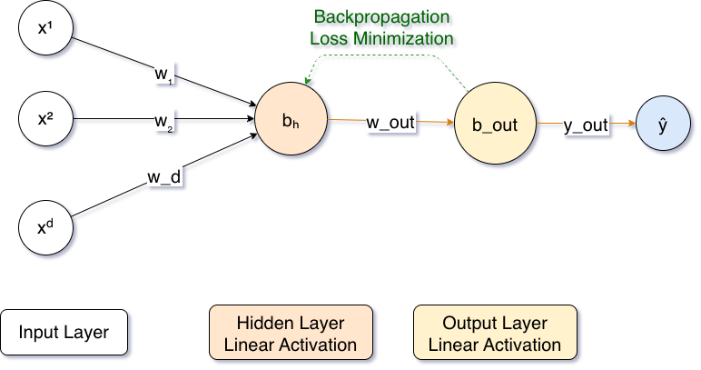
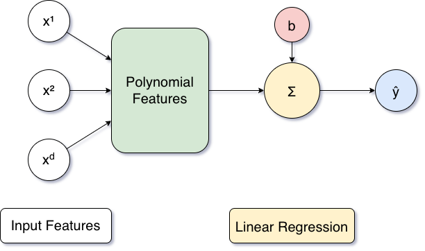

# * chiku*
## Efficient Probabilistic Polynomial Function Approximation Python Library
### Version 2, updated May 2026

[](https://pypi.org/project/chiku/)
[](https://www.gnu.org/licenses/agpl-3.0)


#### Installation

```
pip install chiku
```

To enable the TensorFlow-based ANN approximator:

```
pip install chiku[ann]
```

**Note on TensorFlow.** TensorFlow currently requires Python 3.11. If you intend to use the ANN approximator, set up a Python 3.11 environment and install from source:

```
1. brew install python@3.11
2. python3.11 --version
3. python3.11 -m venv venv
4. source venv/bin/activate
5. pip install -r requirements.txt
6. pip install -e .
7. pytest -v
```


#### What's new in v2.0

- New `RemezSolver` class: a robust iterative implementation of the Remez exchange algorithm. Handles arbitrary continuous functions on arbitrary intervals, with restarts, robust extrema detection (including discontinuity handling), and direct access to power-series or Chebyshev coefficients.
- New `sk_lr` and `sk_lr_cheb` modules: polynomial regression in the monomial and Chebyshev bases via scikit-learn, with automatic feature standardization for high-degree fits on wide intervals.
- All approximators share a unified API: `__init__(f, degree, frange)`, with fitting performed in `__init__` and the same `__len__`, `__getitem__`, `__setitem__`, `get_coeffs`, `print_coeffs`, `predict` interface.
- The `chiku.mpmath` subpackage adds `mpRemez` and is rewritten so every class works directly with mpmath callables at arbitrary precision.
- TensorFlow is now an optional dependency (loaded lazily).
- Pade is reimplemented from scratch over numpy and now accepts `f` directly (no need to chain through Taylor).
- All `predict` methods are vectorized over numpy arrays.
- Python 3.9+ required (Python 3.11 if using the TensorFlow-based ANN approximator).


#### Approximation Libraries

Complex (non-linear) functions like Sigmoid ( $\sigma(x)$ ) and Hyperbolic Tangent ( $\tanh{x}$ ) can be computed with Fully Homomorphic Encryption (FHE) in an encrypted domain using piecewise-linear functions (a linear approximation of $\sigma(x) = 0.5 + 0.25x$ can be derived from the first two terms of Taylor series $\frac{1}{2} + \frac{1}{4}x$ ) or polynomial approximations like Taylor, Pade, Chebyshev, Remez, and Fourier series. These deterministic approaches yield the same polynomial for the same function. In contrast, we propose using an Artificial Neural Network ( $ANN$ ) to derive the approximation polynomial probabilistically, with the coefficients determined by the initial weights and the $ANN$'s convergence. Our scheme is publicly available here as an open-source Python package.

Library | Taylor | Fourier | Pade | Chebyshev | Remez | ANN | LR
--------|--------|---------|------|-----------|-------|-----|----
[numpy](https://github.com/numpy/numpy)   |   |   |   | ✔ |   |   |   
[scipy](https://github.com/scipy/scipy)   | ✔ |   | ✔ |   |   |   |   
[mpmath](https://github.com/mpmath/mpmath) | ✔ | ✔ | ✔ | ✔ |   |   |   
[chiku](https://github.com/devharsh/chiku) | ✔ | ✔ | ✔ | ✔ | ✔ | ✔ | ✔

The table above compares our library with other popular Python packages for numerical analysis. While the $mpmath$ library provides Taylor, Pade, Fourier, and Chebyshev approximations, a user has to transform the functions to suit the $mpmath$ datatypes (e.g., $mpf$ for real float and $mpc$ for complex values). In contrast, our library requires no modifications and can approximate arbitrary functions. Additionally, we provide Remez approximation along with the other methods supported by $mpmath$.


#### Quick Start

```python
import numpy as np
from chiku import taylor, pade, chebyshev, fourier, remez, sk_lr

def sigmoid(x):
    return 1 / (1 + np.exp(-x))

# Taylor expansion at the midpoint of frange
t = taylor.taylor(sigmoid, degree=5, frange=(-1, 1))
print(t.get_coeffs())

# Pade rational approximation, built directly from f
p = pade.pade(sigmoid, pd=3, qd=3, frange=(-1, 1))

# Chebyshev series
c = chebyshev.chebyshev(sigmoid, degree=8, frange=(-1, 1))

# Truncated Fourier series
f = fourier.fourier(lambda x: x*x, degree=70, frange=(-1, 5))

# Iterative Remez minimax
r = remez.RemezSolver(sigmoid, degree=4, frange=(-1, 1))
print(r.get_coeffs(), r.get_error())

# Polynomial regression
m = sk_lr.sk_lr(sigmoid, degree=[1, 2, 3, 4, 5], frange=(-1, 1))
```

For arbitrary-precision variants, use the `chiku.mpmath` subpackage:

```python
import mpmath as mp
from chiku.mpmath import mptaylor, mpremez

def sigmoid_mp(x):
    return 1 / (1 + mp.exp(-x))

mp.dps = 50
t = mptaylor.mpTaylor(sigmoid_mp, fpoint=0, degree=6)
r = mpremez.mpRemez(sigmoid_mp, degree=4, domain=(-1, 1))
```


#### ANN Approximation

While $ANN$ is known for its universal function approximation properties, it is often treated as a black box and used solely to compute outputs. We propose using a basic 3-layer perceptron with an input layer, a hidden layer, and an output layer; both the hidden and output layers have linear activations to generate the coefficients for an approximation polynomial of a given order. In this architecture, the input layer is dynamic, with the input nodes corresponding to the desired polynomial degrees. While having a variable number of hidden layers is possible, we fix it to a single-layer, single-node architecture to minimize computation.



We show coefficient calculations for a third-order polynomial $d=3$ for a univariate function $f(x) = y$ for an input $x$, actual output $y$, and predicted output $y_{out}$.

Input layer weights are

$\{w_1, w_2, \ldots, w_d\} = \{w_1, w_2, w_3\} = \{x, x^2, x^3\}$

and biases are $\{b_1, b_2, b_3\} = b_h$. Thus, the output of the hidden layer is

$y_h = w_1 x + w_2 x^2 + w_3 x^3 + b_h$

The predicted output is calculated by

$y_{out} = w_{out} \cdot y_h + b_{out}$

$\quad\quad = w_1 w_{out} x + w_2 w_{out} x^2 + w_3 w_{out} x^3 + (b_h w_{out} + b_{out})$

where the layer weights $\{w_1 w_{out}, w_2 w_{out}, w_3 w_{out}\}$ are the coefficients for the approximating polynomial of order-3, and the constant term is $b_h w_{out} + b_{out}$.

Our polynomial approximation approach using $ANN$ can generate polynomials with specified degrees. E.g., a user can generate a complete third-order polynomial for $\sin(x)$, which yields a polynomial

$-0.0931199x^3 - 0.001205849x^2 + 0.85615075x + 0.0009873845$

in the interval $[-\pi, \pi]$. Meanwhile, a user may want to optimize the above polynomial by eliminating the coefficient for $x^2$ to reduce costly multiplications in FHE, which yields the following:

$-0.09340597x^3 + 0.8596622x + 0.0005142888.$


#### LR Approximation



`chiku` also supports polynomial approximation using `sklearn.linear_model.LinearRegression`. Unlike the neural-network-based approximation, this method directly solves for coefficients in the polynomial basis:

$f(x) \approx c_0 + c_1 x + c_2 x^2 + \cdots + c_n x^n$

The implementation automatically standardizes polynomial features before regression to improve numerical stability for high-degree polynomials, large domains such as $[-100, 100]$, and ill-conditioned Vandermonde matrices.

**Internal workflow.** Sample points uniformly from the target domain, generate polynomial features

$X = [x, x^2, x^3, \ldots, x^n]$

standardize each feature column with `StandardScaler`, fit linear regression on the standardized matrix, then recover coefficients in the original monomial basis.

**Coefficient recovery.** After scaling, the regression model internally solves

$\hat{y} = \sum_j \frac{W_j}{\sigma_j}\bigl(x^{d_j} - \mu_j\bigr) + B$

so the recovered polynomial coefficients are

$c_{d_j} = \frac{W_j}{\sigma_j}$

and the constant term is

$c_0 = B - \sum_j \frac{W_j}{\sigma_j}\mu_j.$

This yields a stable fit while exposing coefficients in the familiar polynomial form.

A second variant, `sk_lr_cheb`, fits in the Chebyshev basis (via `numpy.polynomial.Chebyshev.fit`) and converts back to the monomial basis. It is more stable than `sk_lr` for very high degrees because the Chebyshev design matrix is near-orthogonal under uniform sampling.


#### Migration from v1

Most v1 code continues to work with minor signature updates. The main changes:

1. The v1 `remez.remez` class did not iterate; it performed a single linear solve on a precomputed reference set. Use `remez.RemezSolver(f, degree, frange)` for the full iterative algorithm.
2. `pade.pade` now takes the target function `f` directly instead of precomputed Taylor coefficients.
3. All approximators use a single `frange=(a, b)` keyword instead of a mix of `frange`, `a, b`, and `domain` arguments.
4. `tf_ann.tf_ann` is now fitted in `__init__`; the separate `fit()` call from v1 has been folded in.

```python
# v1
from chiku import remez, chebyshev
cpoly = chebyshev.chebyshev(sigmoid, degree=6, frange=[-2, 2])
poly  = remez.remez(sigmoid, cpoly.get_coeffs(), degree=4)

# v2
from chiku import remez
poly = remez.RemezSolver(sigmoid, degree=4, frange=(-2, 2))
print(poly.get_coeffs())
```


#### Citation

If you use this library in academic work, please cite any of the following:

```bibtex
@article{trivedi2023sigml++,
  title={Sigml++: Supervised log anomaly with probabilistic polynomial approximation},
  author={Trivedi, Devharsh and Boudguiga, Aymen and Kaaniche, Nesrine and Triandopoulos, Nikos},
  journal={Cryptography},
  volume={7},
  number={4},
  pages={52},
  year={2023},
  publisher={MDPI}
}

@inproceedings{trivedi2023brief,
  title={Brief announcement: Efficient probabilistic approximations for sign and compare},
  author={Trivedi, Devharsh},
  booktitle={International Symposium on Stabilizing, Safety, and Security of Distributed Systems},
  pages={289--296},
  year={2023},
  organization={Springer}
}

@inproceedings{trivedi2024chiku,
  title={chiku: Efficient Probabilistic Polynomial Approximations Library.},
  author={Trivedi, Devharsh and Kaaniche, Nesrine and Boudguiga, Aymen and Triandopoulos, Nikos}
}

@phdthesis{trivedi2024towards,
  title={Towards Efficient Security Analytics},
  author={Trivedi, Devharsh},
  year={2024},
  school={Stevens Institute of Technology}
}
```

#### License

AGPL-3.0-or-later. See `LICENSE`.
